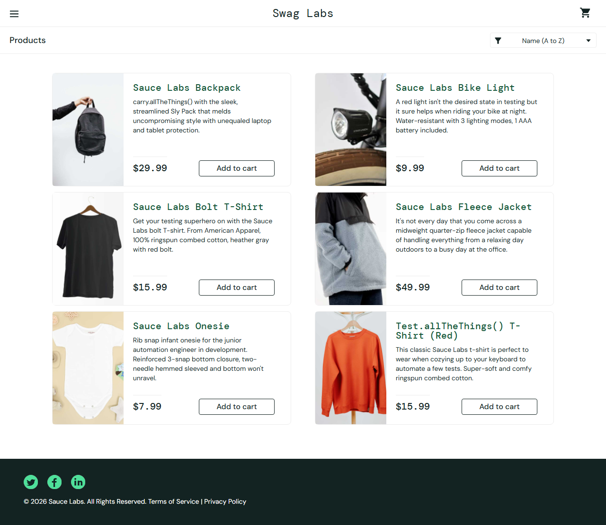
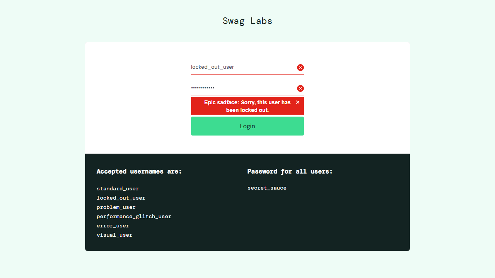
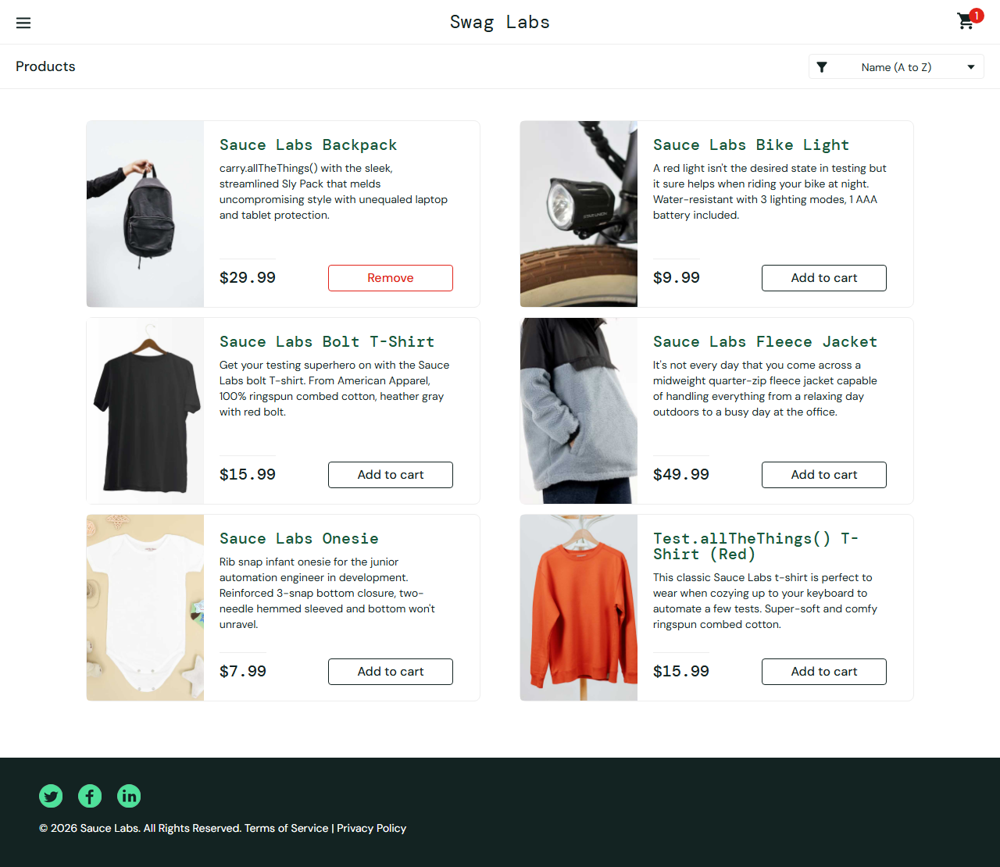
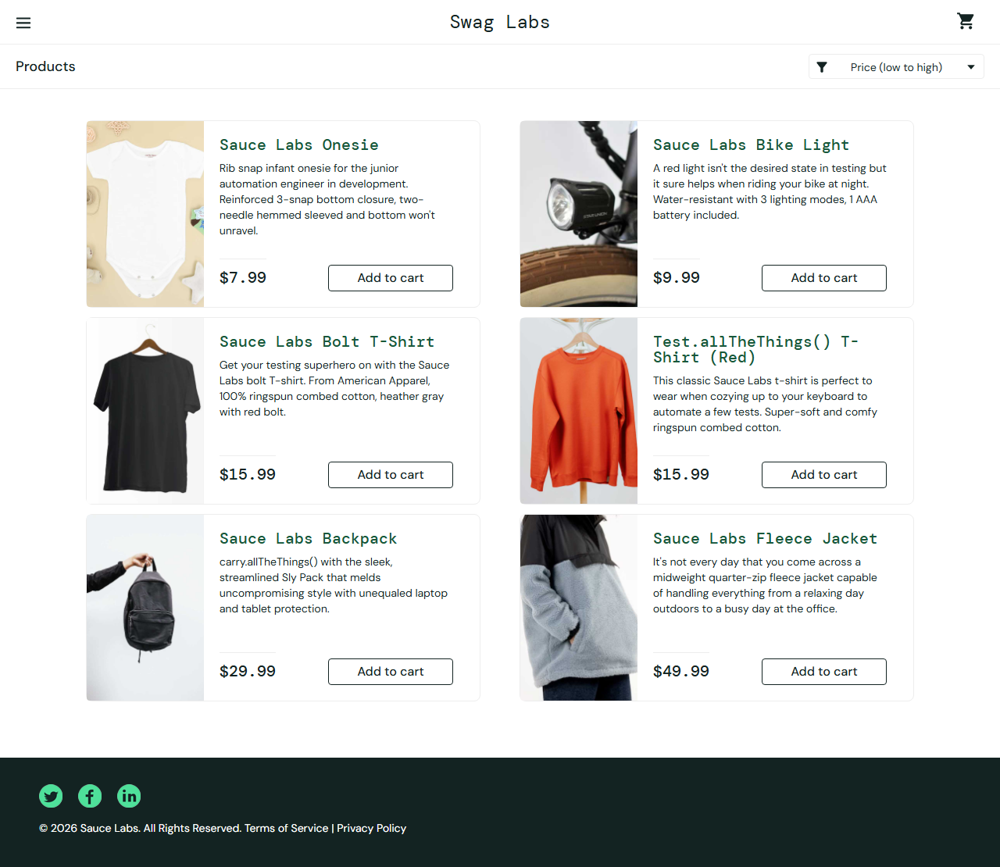
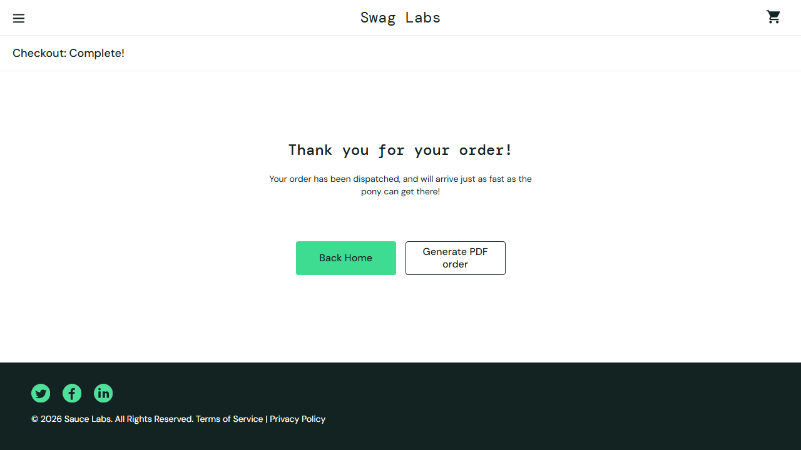

# 🧪 Swag Labs — E2E Test Automation (Playwright + BDD)

[](README.md) [](README-pt-BR.md)

[](https://github.com/jessicasalestech/swag-labs-playwright-bdd/actions/workflows/ci.yml)


A **QA portfolio project** demonstrating a complete end-to-end (UI) test automation
framework, applied to the demo app **[Swag Labs](https://www.saucedemo.com)** (Sauce Labs).

> A stable, public training app — ideal for showing the framework in a reproducible,
> self-contained way.

## 🚀 Stack

| Technology | Use |
| --- | --- |
| **Playwright** (`1.6x`) | Browser automation (Chromium and Firefox) |
| **TypeScript** (strict) | Safe typing for test code |
| **playwright-bdd** (`9.x`) | Write scenarios in **Gherkin pt-BR** and run them with the Playwright runner |
| **Page Objects (POM)** | Selector reuse and isolation |
| **Allure Report** | Rich report with evidence (steps, screenshots, history) |
| **GitHub Actions** | CI: runs the suite, generates reports and publishes artifacts |

## 📁 Project structure

```
.
├── features/            # BDD scenarios in Gherkin pt-BR
│   ├── login.feature
│   ├── inventory.feature
│   └── checkout.feature
├── steps/               # Step definitions (bridge Gherkin to code)
├── fixtures/            # Extended fixtures + injected Page Objects
├── src/pages/           # Page Objects (Login, Inventory, Cart, Checkout)
├── support/             # Environment config (.env)
├── .github/workflows/   # CI (Playwright + Allure)
└── playwright.config.ts # Playwright + playwright-bdd config
```

## ✅ What is covered

- **Login** — success, locked-out user and invalid credentials (error message validation).
- **Catalog** — add products to cart (badge count) and sort by price.
- **Checkout** — full purchase flow through to order confirmation.

## 📸 Evidence

Screenshots automatically captured at the end of every scenario:

| | |
|---|---|
|  |  |
|  |  |
|  |  |
|  | — |

> 💡 Evidence is captured by an automatic fixture (`autoScreenshot`), so any new
> scenario generates its own screenshot with no extra effort.

## 🔧 Prerequisites

- Node.js **≥ 20.10**
- npm

## ▶️ How to run

```bash
# 1. Install dependencies
npm install

# 2. Install browsers (Chromium; Firefox optional)
npm run install:browsers

# 3. Copy the environment (defaults already point to the demo app)
cp .env.example .env

# 4. Run the suite (Chromium and Firefox)
npm run test

# Run only Chromium
npx playwright test --project=chromium

# Run a specific scenario (search by title)
npx playwright test --project=chromium --grep "Login com sucesso"
```

### Reports

```bash
# Playwright HTML (opens interactive)
npm run report

# Allure report
npm run allure:report    # generate from allure-results/
npm run allure:open      # open in the browser
```

### 🌐 Online report (GitHub Pages)

The CI publishes the **Allure Report** on GitHub Pages on every push:

**🔗 https://jessicasalestech.github.io/swag-labs-playwright-bdd/**

Nothing to install: it's updated automatically by the pipeline (`actions/deploy-pages`).

## 🤖 CI (GitHub Actions)

On the pipeline (`ci.yml`), the suite runs on **Chromium and Firefox**. On failure,
these are published as artifacts: Playwright HTML report, **Allure Report** and
**traces** (for failure debugging).

## 💡 Best practices applied

- **Page Objects** — centralized, reusable selectors, no hardcoding in tests.
- **Gherkin pt-BR** — scenarios readable by PO/Dev/QA without knowing automation.
- **Credentials via `.env`** — no password/personal data in the repo
  (`.env.example` is the versioned reference; `.env` is ignored).
- **Robustness** — `workers: 1` + navigation retry mitigate demo app network flakiness.
- **Deterministic config** — no AI/self-healing at runtime, only stable selectors.

## 🛡️ Security

- The target app is a **public demo** (fake data).
- `PASSWORD` and credentials are **not** versioned — they come from `.env` / CI secrets.

---

**Author:** Jessica Sales · QA